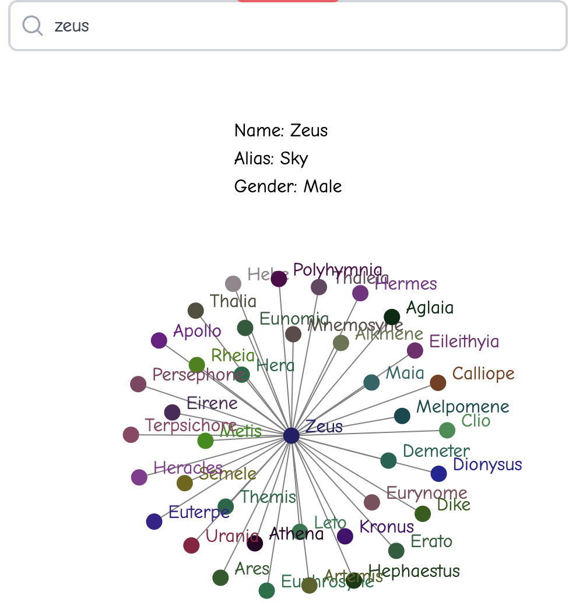

## Family tree of the Greek Gods

Based off the 8th century [Theogony poem](https://en.wikipedia.org/wiki/Theogony) by Hesiod.


##### Initial setup for Neo4j

Run `zsh restart.zsh` command for first time setup.

You only need to run this script once. 

Re-running will reset scripts and data each time. Thus only run it again if intentionally resetting. 

If there are issues in running this script, watch for the error logs explaining resolutions.

The above setup suffices for Neo4j setup. You can access the database via: [UI](http://localhost:7474/browser/)

###### The following is to use the data in an UI plus write our own db queries. 

##### Commands

Run the following to install all dependencies first.
Best to be on node version `18.16.0` and above. 

```bash
yarn
```

Then, start the development server:

```bash
yarn dev
```
Once server is started, can run and test the queries via the `request.http` file in this project.

Or go to [localhost:3000](http://localhost:3000) to view Greek God information on homepage.

Example UI output for a Greek God Character


